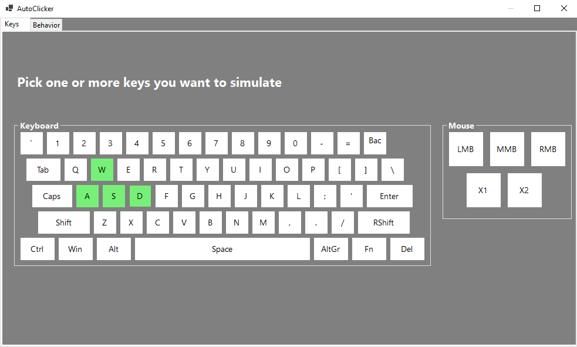
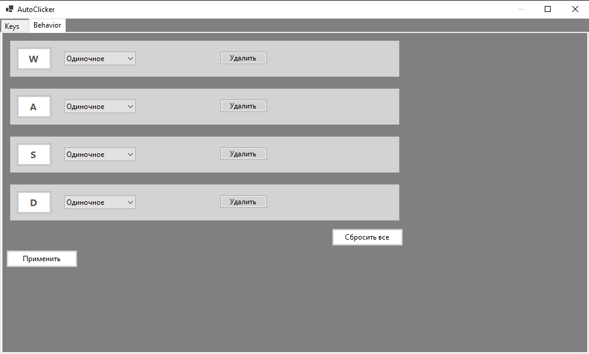

# AutoClicker
## Описание программы
Это программа "умного" автокликера, которая имеет возможность симулировать несколько клавиш / кнопок одновременно. Всего в приложении две странички: одна с возможностью выбора необходимых кнопок / клавиш, а вторая с настройкой функционала для этих клавиш. Пользователю необходимо лишь выбрать те клавиши, которые он хочет симулировать и настроить их на второй страничке. 

Чтобы запустить приложение необходимо нажать F6 (пока что без возможности выбора другой клавиши) внутри приложения (тоже временное решение)

## Инстурментарий разработки
Для разработки приложения использовался язык программирования C# и WinForms. Почему WinForms, а не WPF: для использования WPF необходимо знание языка разметки XAML, в силу моего незнания был выбран более простой инструмент разработки WinForms. Возможно переписание проекта с использованием WPF в дальнейшем.

## Интерфейс страничек приложения
Интерфейс главной страницы с выбранными клавишами.

Интерфейс старнички с настройкой логики для клавиш.

## Ближайшие планы:
Так как приложение задумывалось как автокликер для автоматизации рутинных процессов в играх, то необходимо разработать решение, чтобы эти самые "клики" воспринимались играми как непосредственные нажатия, а не "вирутальные клики". На данный момент приложение работает в блокноте и в браузере. Ведется активная разработка над решением проблемы неработоспособности в играх и других приложениях. 

Также необходимо добавить возможность выбора горячей клавиши

И необходимо сделать нажатие горячей клавиши глобальным, чтобы запуск приложения происходил не только изнутри самого приложения
